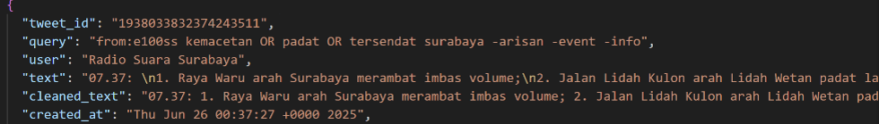
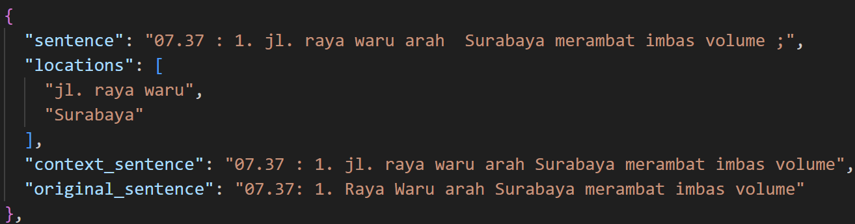
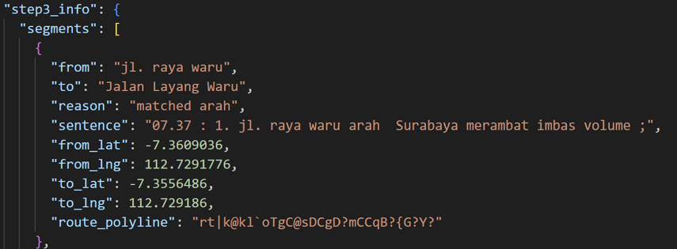

# Road Closure Map - Backend

Backend API for the Road Closure Information application. It processes traffic reports, stores structured road-closure data, and provides endpoints used by the mobile frontend to display closures and alternative routes.

## Features

- Store traffic reports and affected road segments
- Extract and process road locations from traffic information
- Provide coordinates and closure polylines through an API
- Support route and road-closure checking
- Manage scheduled traffic-data updates

## Tech Stack

- Python
- Django / Django REST Framework
- PostgreSQL
- NLP and rule-based location extraction
- Maps and geocoding APIs

> Adjust this list if your final backend uses different technologies.

## Installation

1. Clone the repository.

   ```bash
   git clone [BACKEND_REPOSITORY_URL]
   cd [BACKEND_FOLDER_NAME]
   ```

2. Create and activate a virtual environment.

   ```bash
   python -m venv venv
   ```

   Windows:

   ```bash
   venv\Scripts\activate
   ```

   Linux/macOS:

   ```bash
   source venv/bin/activate
   ```

3. Install dependencies.

   ```bash
   pip install -r requirements.txt
   ```

4. Create a `.env` file and configure the required values.

   ```env
   SECRET_KEY=[YOUR_SECRET_KEY]
   DEBUG=True
   DATABASE_URL=[YOUR_DATABASE_URL]
   MAPS_API_KEY=[YOUR_MAPS_API_KEY]
   ```

5. Run database migrations and start the server.

   ```bash
   python manage.py migrate
   python manage.py runserver
   ```

The API will be available at `http://127.0.0.1:8000/` by default.

## Main API Endpoints

| Method | Endpoint | Description |
| --- | --- | --- |
| `GET` | `/api/traffic-reports/` | Get traffic reports |
| `GET` | `/api/traffic-segments/` | Get affected road segments |
| `GET` | `/api/traffic-segments/{id}/` | Get one road segment |

> Replace the endpoints above with the routes used in your project.

## Screenshots

### API Response



### Data Processing Result

This is extraction location from the sentence



This is after using location to form route of the road closure



## Project Structure

```text
[project-root]/
├── [main-app]/
├── [api-app]/
├── manage.py
├── requirements.txt
├── .env.example
└── README.md
```

## Related Repository

- Frontend: [FRONTEND_REPOSITORY_URL]

## Author

Muhammad Anand Fardhani  
<a href="www.linkedin.com/in/muhammad-anand-fardhani-1b4484170">
Linkedin Profile
</a>
